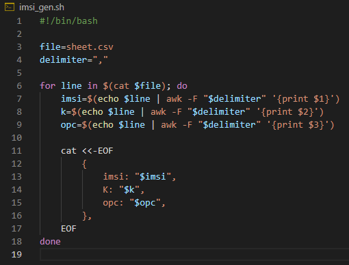
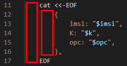
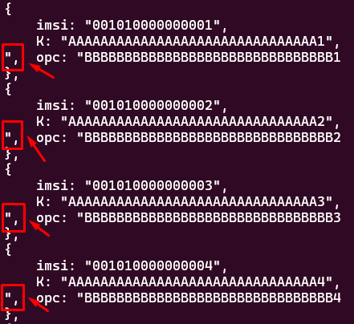

# cat

O comando ``cat`` é muito utilizado para ler aquivos de texto no shell do Linux.

Uso simples lendo o conteúdo de um arquivo:

```bash
$ cat sheet.csv
001010000000001,AAAAAAAAAAAAAAAAAAAAAAAAAAAAAAA1,BBBBBBBBBBBBBBBBBBBBBBBBBBBBBBB1
001010000000002,AAAAAAAAAAAAAAAAAAAAAAAAAAAAAAA2,BBBBBBBBBBBBBBBBBBBBBBBBBBBBBBB2
001010000000003,AAAAAAAAAAAAAAAAAAAAAAAAAAAAAAA3,BBBBBBBBBBBBBBBBBBBBBBBBBBBBBBB3
001010000000004,AAAAAAAAAAAAAAAAAAAAAAAAAAAAAAA4,BBBBBBBBBBBBBBBBBBBBBBBBBBBBBBB4
001010000000005,AAAAAAAAAAAAAAAAAAAAAAAAAAAAAAA5,BBBBBBBBBBBBBBBBBBBBBBBBBBBBBBB5
001010000000006,AAAAAAAAAAAAAAAAAAAAAAAAAAAAAAA6,BBBBBBBBBBBBBBBBBBBBBBBBBBBBBBB6
```

## cat, EOF, CRLF e LF

Podemos utilizar o comando cat e o EOF para escrever blocos de texto, evitando o uso repetitivo do comando echo, porém é necessário entender alguns detalhes com relação à tabulação.

No comando cat quando vamos usar com EOF, o tab e o espaço são tratados de formas diferentes.

Vamos utilizar o exemplo abaixo de script onde ele lê os valores de um arquivo csv e irá gerar um texto que será usado em uma configuração de geração de UEs no equipamento Amarisoft Simbox, porém não se preocupe com a aplicação, pois pode ser de acordo com a sua necessidade.



O ``cat <<-EOF`` irá enviar para o comando cat todo o conteúdo abaixo, até encontrar novamente o EOF de fechamento, desconsiderando o caracter tab (hex: 09). Ao utilizar ``cat <<EOF``, note que foi retirado o hífen, o caracter tab (hex: 09), não será desconsiderado, ou seja, o EOF de fechamento não poderá ser identado, sendo necessário ficar no início da linha sem qualquer espaço ou tab antecedendo, caso contrário irá apresentar erro.

Porém, quando utilizamos ``cat <<-EOF``, se utilizarmos 4 espaços antes do EOF de fechamento, ao invés do tab (hex: 09), teremos o mesmo erro:

```error
user@domain$ ./imsi_gen.sh
./imsi_gen.sh: line 18: warning: here-document at line 11 delimited by end-of-file (wanted `EOF')
./imsi_gen.sh: line 19: syntax error: unexpected end of file
```

Ou seja, se quero ter um código identado e ao mesmo tempo gerando uma saída tabulada, será necessário usar tabulação via tab (hex: 09) para identar o código e espaço para identar a minha saída do comando cat. Por exemplo, abaixo as partes marcadas em vermelho são tabulação por tab (hex: 09), já as demais tabulações foram feitas via espaço (hex: 20).



Podemos ver com mais detalhes através do hexadecimal apenas da parte de código em questão:

```hex
$ hexdump -v -e '/1 "%02x "' imsi_gen.sh | sed 's/0a /0a\n/g'
09 63 61 74 20 3c 3c 2d 45 4f 46 0a
09 09 7b 0a
09 09 20 20 20 20 69 6d 73 69 3a 20 22 24 69 6d 73 69 22 2c 0a
09 09 20 20 20 20 4b 3a 20 22 24 6b 22 2c 0a
09 09 20 20 20 20 6f 70 63 3a 20 22 24 6f 70 63 22 2c 0a
09 09 7d 2c 0a
09 45 4f 46 0a
64 6f 6e 65 0a
```

Utilizando esse conceito, ao executar o código, temos a seguinte saída:

```json
{
    imsi: "001010000000001",
    K: "AAAAAAAAAAAAAAAAAAAAAAAAAAAAAAA1",
    opc: "BBBBBBBBBBBBBBBBBBBBBBBBBBBBBBB1",
},
{
    imsi: "001010000000002",
    K: "AAAAAAAAAAAAAAAAAAAAAAAAAAAAAAA2",
    opc: "BBBBBBBBBBBBBBBBBBBBBBBBBBBBBBB2",
},
{
    imsi: "001010000000003",
    K: "AAAAAAAAAAAAAAAAAAAAAAAAAAAAAAA3",
    opc: "BBBBBBBBBBBBBBBBBBBBBBBBBBBBBBB3",
},
{
    imsi: "001010000000004",
    K: "AAAAAAAAAAAAAAAAAAAAAAAAAAAAAAA4",
    opc: "BBBBBBBBBBBBBBBBBBBBBBBBBBBBBBB4",
},
{
    imsi: "001010000000005",
    K: "AAAAAAAAAAAAAAAAAAAAAAAAAAAAAAA5",
    opc: "BBBBBBBBBBBBBBBBBBBBBBBBBBBBBBB5",
},
{
    imsi: "001010000000006",
    K: "AAAAAAAAAAAAAAAAAAAAAAAAAAAAAAA6",
    opc: "BBBBBBBBBBBBBBBBBBBBBBBBBBBBBBB6",
},
```

Outro ponto muito importante é que o arquivo que será lido pelo script Bash tenha como caracter de quebra de linha o *Line Feed* (LF, hex: 0A) ao invés do *Carriage Feed Line Feed* (CRLF, hex: 0D 0A). Caso contrário irá apresentar inconsistências, por exemplo:



Como podemos ver na imagem acima os caracteres ``",`` ficaram fora do local correto devido à algum bug, e que pode simplesmente ser resolvido alterando a quebra de linha para LF.
