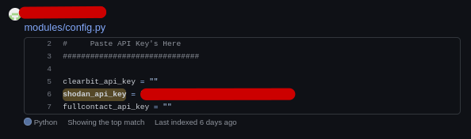

# Shodan

<https://shodan.io>

Esse site é um bot scanner que varre várias portas no mundo todo.
É necessário efetuar o cadastro para ter acesso à alguns filtros específicos.

Pesquisando câmeras em um país específico:  
``camera country:"BR"``

Pesquisando um equipamento por país e cidade:  
``camera country:"BR" city:"São Paulo"``

Pesquisa por sistema operacional:  
``os:"Windows" country:"BR"``

Pesquisa por porta:  
``port:3389 country:"BR"``

Pesquisa por IP:  
``ip:173.45.92.12``

Pesquisa por bloco de rede:  
``ip:173.45.92.0/30``

Pesquisa por hostname:  
``hostname:alvo.com.br``

O Shodan exibe também a localização, porém essa localização não é exata e normalmente pega como base a localização do link que fornece a conexão para o alvo pesquisado.

## BugBounty

A ideia é pegar determinada falha e procurar em massa no Shodan.  
Para isso veja primeiramente a query da falha que deseja pesquisar em massa utilizando os [templates do nuclei](https://github.com/projectdiscovery/nuclei-templates):

```bash
$ grep -R shodan-query ~/nuclei-templates
/root/nuclei-templates/exposed-panels/kerio-connect-client.yaml:    shodan-query: http.title:"Kerio Connect Client"
/root/nuclei-templates/exposed-panels/appsmith-web-login.yaml:    shodan-query: http.title:"appsmith"
/root/nuclei-templates/exposed-panels/acrolinx-dashboard.yaml:    shodan-query: http.title:"Acrolinx Dashboard"
/root/nuclei-templates/exposed-panels/icc-pro-login.yaml:    shodan-query: title:"Login to ICC PRO system"
/root/nuclei-templates/exposed-panels/virtua-software-panel.yaml:    shodan-query: http.favicon.hash:876876147
/root/nuclei-templates/exposed-panels/audiocodes-detect.yaml:    shodan-query: http.html:"Audiocodes"
/root/nuclei-templates/exposed-panels/aircube-login.yaml:    shodan-query: http.favicon.hash:1249285083
/root/nuclei-templates/exposed-panels/3cx-phone-webclient-management-panel.yaml:    shodan-query: http.title:"3CX Webclient"
/root/nuclei-templates/exposed-panels/aqua-enterprise-panel.yaml:    shodan-query: http.title:"Aqua Enterprise" || http.title:"Aqua Cloud Native Security Platform"
/root/nuclei-templates/exposed-panels/ocs-inventory-login.yaml:    shodan-query: title:"OCS Inventory"
/root/nuclei-templates/exposed-panels/hashicorp-consul-webgui.yaml:    shodan-query: http.title:"Consul by HashiCorp"
/root/nuclei-templates/exposed-panels/workspace-one-uem.yaml:    shodan-query: http.html:"Airwatch"
```

Antes de prosseguir precisamos deixar em funcionamento os software de pesquisa que vai consumir a API do Shodan e para isso é necessário ter uma chave de API Pro ou pegar emprestado de alguém que deixou exposto no GitHub (não recomendo) através da seguinte Dork:

**Dork:** <https://github.com/search?o=desc&p=2&q=shodan_api_key+language%3Apython&s=indexed&type=Code>



Pegue a chave da API e execute o seguinte comando:

```bash
shodan init CHAVE_DA_API
```

O comando de cima só irá funcionar se você tiver instalado o shodan:

```bash
pip3 install shodan
```

Depois verifique se a chave de API aplicada possui creditos para executar as buscas:

```bash
$ shodan info
Query credits available: 0
Scan credits available: 0
```

Mais informações sobre os créditos: <https://help.shodan.io/the-basics/credit-types-explained>

A instalação da ferramenta shoscan-cli pode ser acompanhada no próprio repositório da ferramenta:

<https://github.com/imhunterand/shoscan-cli>

Depois de instalar a ferramenta shoscan-cli, execute e entre com os valores pedidos.  

```bash
$ bash run.sh
1. Select a task.
1. Search and download results from Shodan using the same query syntax as the website.
Enter the search term(query) :  http.favicon.hash:1249285083
Save as[file name] : nome_do_arquivo
```

Será gerado um arquivo (nome_do_arquivo.gz), onde para descompactá-lo basta executar o gunzip:

```bash
gunzip nome_do_arquivo.gz
```

Depois podemos extrair as informações do json com o jq:

```bash
cat nome_do_arquivo.json | jq -R '.hostnames[]'
```
